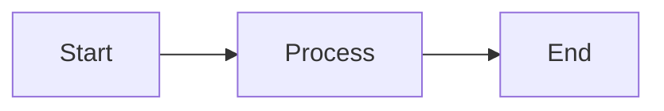

# 📚 G-Forge IoT Documentation

Welcome to the G-Forge IoT documentation! This folder contains comprehensive guides, references, and runbooks for the entire system.

---

## 🚀 Quick Start

**New to the project?** Start here:
1. Read [INDEX.md](./INDEX.md) for a complete overview
2. Check [TECH_STACK.md](./TECH_STACK.md) to understand technologies used
3. Review [TODO_AWS_INFRASTRUCTURE_DOCS.md](./TODO_AWS_INFRASTRUCTURE_DOCS.md) for documentation roadmap

---

## 📁 Documentation Structure

```
/docs
├── README.md (this file)
├── INDEX.md (master reference)
├── TECH_STACK.md (complete technology overview)
├── TODO_AWS_INFRASTRUCTURE_DOCS.md (documentation roadmap)
│
├── /architecture
│   ├── FUNCTIONAL_OVERVIEW.md (what the system does)
│   ├── TECHNICAL_ARCHITECTURE.md (how it works)
│   └── SYSTEM_DIAGRAMS.md (visual diagrams)
│
├── /database
│   ├── DYNAMODB_SCHEMA.md (all tables and indexes)
│   └── ACCESS_PATTERNS.md (query patterns)
│
├── /api
│   ├── API_REFERENCE.md (complete API docs)
│   └── GRAPHQL_SCHEMA.md (GraphQL types)
│
├── /streaming
│   ├── RADIO_STACK.md (streaming architecture)
│   ├── LIQUIDSOAP_CONFIG.md (Liquidsoap setup)
│   └── STEREO_TOOL_SETUP.md (audio processing)
│
├── /infrastructure
│   ├── AWS_RESOURCES.md (complete AWS inventory)
│   ├── LAMBDA_FUNCTIONS.md (all Lambda functions)
│   └── EC2_SETUP.md (EC2 configuration)
│
├── /operations
│   ├── DEPLOYMENT.md (how to deploy)
│   ├── RUNBOOK.md (day-to-day operations)
│   ├── MONITORING.md (monitoring setup)
│   └── COST_OPTIMIZATION.md (cost management)
│
├── /security
│   ├── SECURITY.md (security policies)
│   └── IAM_POLICIES.md (IAM reference)
│
└── /onboarding
    ├── GETTING_STARTED.md (quick start guide)
    └── DEVELOPMENT_SETUP.md (local dev setup)
```

---

## 🎯 Most Common Tasks

### Deploy Application
```bash
npx ampx sandbox  # Local development
npx ampx sandbox deploy --name prod  # Production
```

### Trigger Playlist Update
```bash
aws lambda invoke \
  --function-name amplify-gforgeiot-gerard--streamplaylistupdaterlam-qbTpNx6cATgr \
  --region eu-west-1 \
  response.json
```

### Check Stream Status
```bash
curl http://46.137.184.91/status-json.xsl | jq '.icestats.source'
```

### Restart Radio Stream
```bash
ssh radio-ec2 "sudo pkill liquidsoap && nohup liquidsoap /opt/radio/radio.liq &"
```

### View Lambda Logs
```bash
aws logs tail /aws/lambda/[function-name] --follow --region eu-west-1
```

---

## 📊 System Status

| Component | Status | URL |
|-----------|--------|-----|
| **Web App** | ✅ Active | `[Amplify URL]` |
| **GraphQL API** | ✅ Active | AppSync endpoint |
| **Radio Stream** | ✅ Active | `http://46.137.184.91:8000/stream-processed.mp3` |
| **Web Player** | ✅ Active | `http://46.137.184.91/` |
| **Icecast** | ✅ Active | Port 8000 |
| **Liquidsoap** | ✅ Active | PID check on EC2 |

---

## 🛠️ Key Technologies

- **Frontend:** React 18, TypeScript, Vite, TailwindCSS
- **Backend:** AWS Amplify Gen 2, Lambda, DynamoDB, S3
- **Streaming:** Liquidsoap, Icecast, Stereo Tool, Nginx
- **Infrastructure:** AWS (EC2, CloudWatch, EventBridge, SQS)

[Full tech stack →](./TECH_STACK.md)

---

## 📖 Documentation Status

| Category | Status | Priority |
|----------|--------|----------|
| **Index & Overview** | 🟢 Complete | HIGH |
| **Tech Stack** | 🟢 Complete | HIGH |
| **Architecture** | 🔴 TODO | HIGH |
| **Database Schema** | 🔴 TODO | HIGH |
| **Lambda Functions** | 🔴 TODO | HIGH |
| **Streaming Setup** | 🟡 Partial | MEDIUM |
| **Operations** | 🔴 TODO | HIGH |
| **Security** | 🔴 TODO | MEDIUM |
| **Onboarding** | 🔴 TODO | MEDIUM |

**Legend:** 🟢 Complete | 🟡 In Progress | 🔴 TODO

---

## 🤝 Contributing to Docs

### Guidelines
1. **Keep it up-to-date** - Update docs with code changes
2. **Be clear and concise** - Avoid jargon
3. **Include examples** - Show, don't just tell
4. **Add diagrams** - Visual > text for architecture
5. **Test commands** - Ensure all code blocks work
6. **Link related docs** - Help readers navigate

### Documentation Workflow
1. Create/update document in appropriate folder
2. Update [INDEX.md](./INDEX.md) with new doc
3. Add entry to this README if needed
4. Mark status (🔴 TODO → 🟡 In Progress → 🟢 Complete)
5. Request review from team member

---

## 📝 Documentation Standards

### File Naming
- Use `UPPERCASE_WITH_UNDERSCORES.md` for primary docs
- Use `lowercase-with-dashes.md` for supporting docs
- Always use `.md` extension

### Structure
```markdown
# Title

**Last Updated:** [Date]
**Version:** [Semantic version]

---

## Table of Contents
- Links to sections

---

## Section 1
Content with examples

## Section 2
More content

---

**Last Updated:** [Date]
```

### Code Blocks
Always specify language:
```bash
# Good
aws lambda invoke ...
```

```typescript
// Good
const example = "TypeScript code"
```

### Diagrams
Use Mermaid.js for flowcharts:


---

## 🔗 External Links

- [AWS Amplify Gen 2 Docs](https://docs.amplify.aws/gen2/)
- [Liquidsoap Manual](https://www.liquidsoap.info/doc.html)
- [React Documentation](https://react.dev/)
- [DynamoDB Developer Guide](https://docs.aws.amazon.com/dynamodb/)

---

## 📞 Need Help?

- **Technical Questions:** Check [INDEX.md](./INDEX.md) first
- **Operations Issues:** See [Runbook](./operations/RUNBOOK.md) (TODO)
- **Architecture Questions:** See [Technical Architecture](./architecture/TECHNICAL_ARCHITECTURE.md) (TODO)
- **Setup Help:** See [Getting Started](./onboarding/GETTING_STARTED.md) (TODO)

---

## 📅 Documentation Roadmap

**Phase 1 (Week 1)** - Critical Docs
- [x] Documentation structure
- [x] Tech stack overview
- [x] Master index
- [ ] Functional overview
- [ ] Technical architecture
- [ ] AWS resources inventory

**Phase 2 (Week 2)** - Operational Docs
- [ ] Lambda functions reference
- [ ] Database schema
- [ ] Deployment guide
- [ ] Operations runbook

**Phase 3 (Week 3)** - Supporting Docs
- [ ] API reference
- [ ] Security guide
- [ ] Cost optimization
- [ ] Onboarding guides

[Full roadmap →](./TODO_AWS_INFRASTRUCTURE_DOCS.md)

---

## ✅ Quick Checklist for New Team Members

- [ ] Read [INDEX.md](./INDEX.md)
- [ ] Review [TECH_STACK.md](./TECH_STACK.md)
- [ ] Setup local development environment
- [ ] Deploy sandbox environment
- [ ] Test GraphQL API
- [ ] Access EC2 instance
- [ ] Test radio stream
- [ ] Review operational procedures

---

**Documentation Version:** 1.0.0  
**Last Major Update:** 13 November 2025  
**Maintained By:** Development Team  
**Review Frequency:** Monthly
